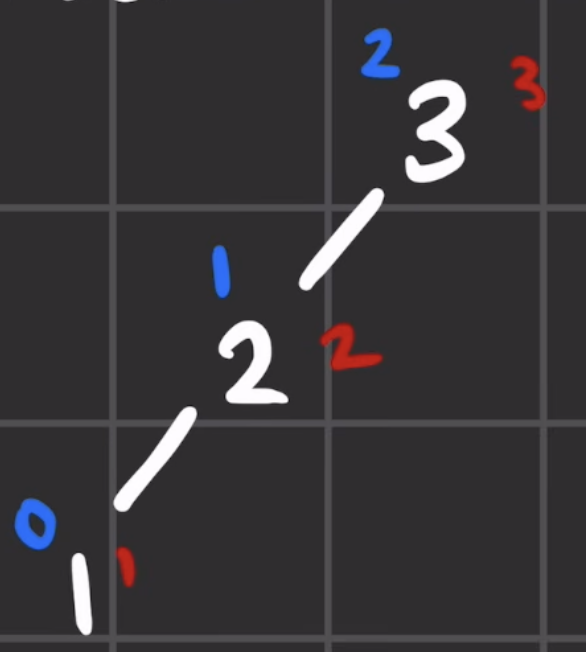
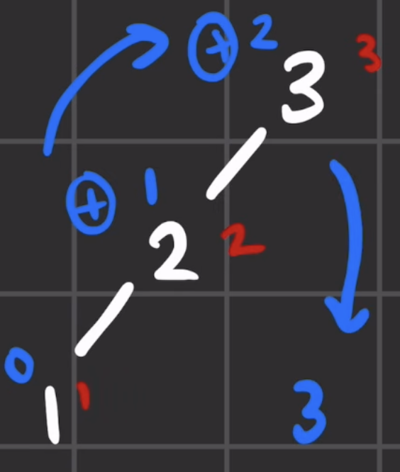
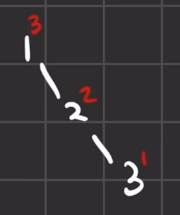
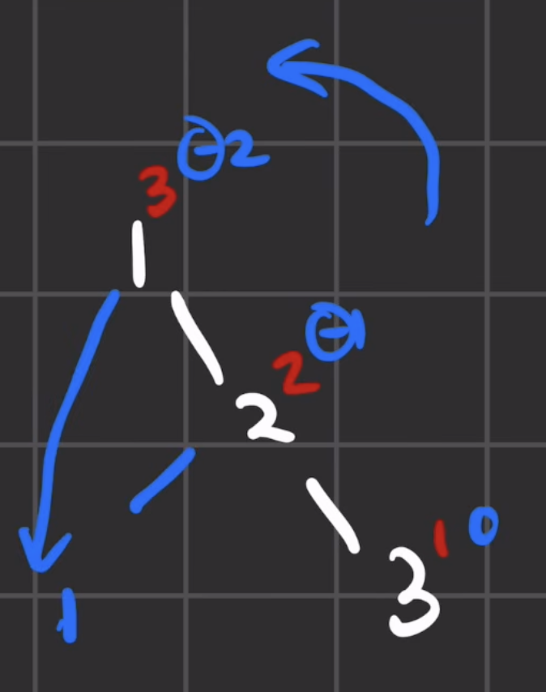
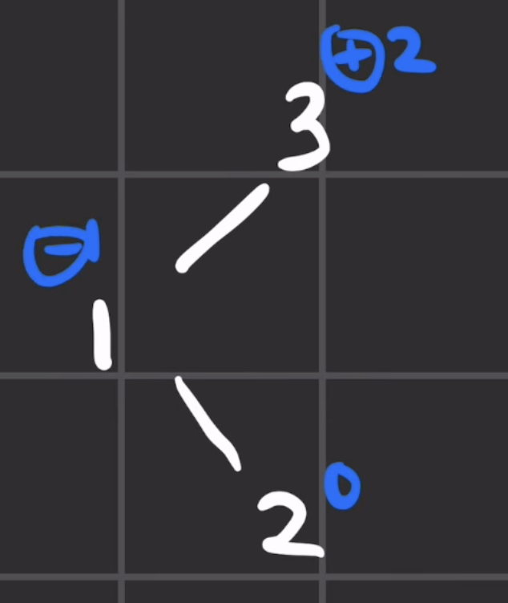
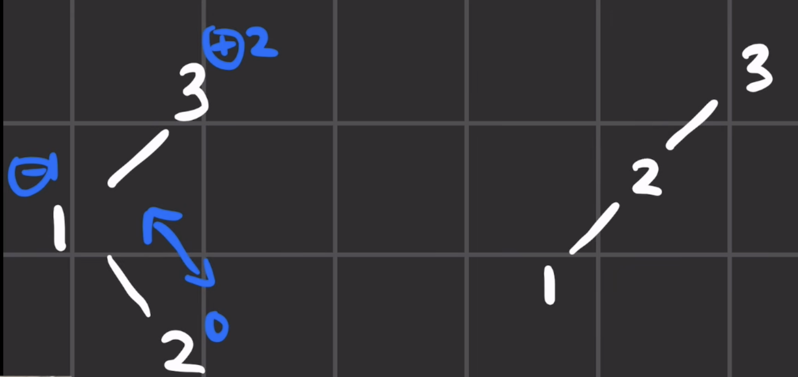
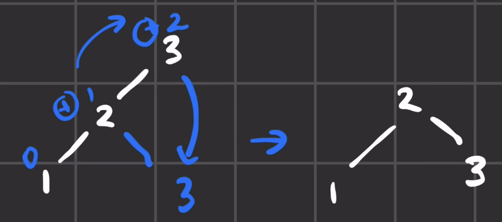
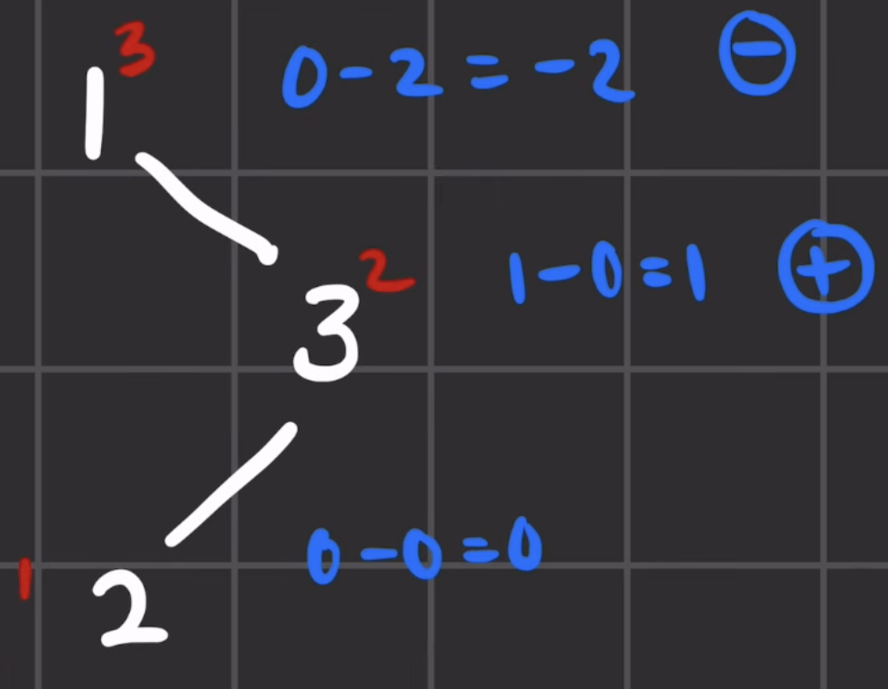
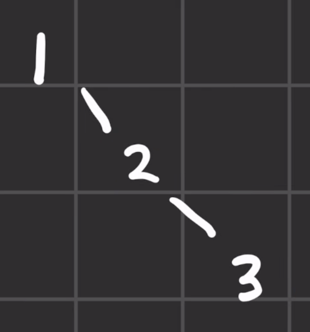

# AVL Rotation Images and Cases

[&larr; Back to Lab 3](README.md)

AVL rotations repair a local imbalance without changing the tree's in-order
traversal. The examples below use the keys `1`, `2`, and `3`, so the valid
in-order traversal is always `[1, 2, 3]`.

The balance factor used in this lab is

$$
\operatorname{BF}(v)
= \operatorname{height}(v.\text{left})
- \operatorname{height}(v.\text{right}).
$$

- A positive balance factor means the node is left-heavy.
- A negative balance factor means the node is right-heavy.
- A node needs rebalancing when its balance factor is `+2` or `-2`.

## Quick reference

| Case | Shape from the unbalanced node | Repair |
|---|---|---|
| **LL** | left, then left | one right rotation |
| **RR** | right, then right | one left rotation |
| **LR** | left, then right | left rotation, then right rotation |
| **RL** | right, then left | right rotation, then left rotation |

The single rotations come first because each takes one step. The double
rotations reuse those same moves in sequence.

---

## 1. LL case: single right rotation

The LL case occurs when the unbalanced node and its left child are both
left-heavy. Here, node `3` is the unbalanced node, and the heavy path is
`3 -> 2 -> 1`.

### Before the rotation



### After rotating right at node 3

Node `2` moves up, node `3` moves down to the right, and node `1` remains on
the left. The resulting tree has `2` as its root with children `1` and `3`.



```text
    2
   / \
  1   3
```

---

## 2. RR case: single left rotation

The RR case is the mirror image of LL. Node `1` is the unbalanced node, and
the heavy path is `1 -> 2 -> 3`.

### Before the rotation



### After rotating left at node 1

Node `2` moves up, node `1` moves down to the left, and node `3` remains on
the right.



```text
    2
   / \
  1   3
```

---

## 3. LR case: left rotation, then right rotation

The LR case forms a zig-zag: node `3` is left-heavy, but its left child `1`
is right-heavy. A single rotation cannot repair both directions, so this case
uses two rotations.

### Before either rotation



### After rotation 1: rotate left at node 1

The first rotation straightens the zig-zag into an LL chain:
`3 -> 2 -> 1`.



### After rotation 2: rotate right at node 3

The second rotation is the same right-rotation move used in the simple LL
case. Node `2` becomes the subtree root.



```text
    2
   / \
  1   3
```

---

## 4. RL case: right rotation, then left rotation

The RL case is the mirror image of LR. Node `1` is right-heavy, but its right
child `3` is left-heavy.

### Before either rotation



### After rotation 1: rotate right at node 3

The first rotation straightens the zig-zag into the RR chain
`1 -> 2 -> 3`.



### Rotation 2: mirror the simple RR case

The final RL drawing is not included. Its last step is the same **left
rotation** shown in the simpler [RR case](#2-rr-case-single-left-rotation):
rotate left at node `1`. Node `2` becomes the root, with `1` on its left and
`3` on its right.

```text
    2
   / \
  1   3
```

---

## What to remember

- **LL** and **RR** are straight lines and need one rotation.
- **LR** and **RL** are zig-zags and need two rotations.
- The first step of a double rotation straightens the zig-zag.
- The second step is one of the single rotations already used for LL or RR.
- Every case preserves the in-order traversal `[1, 2, 3]`.

[&larr; Return to the Lab 3 instructions](README.md)
